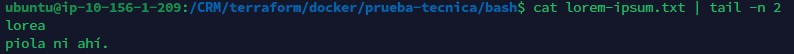
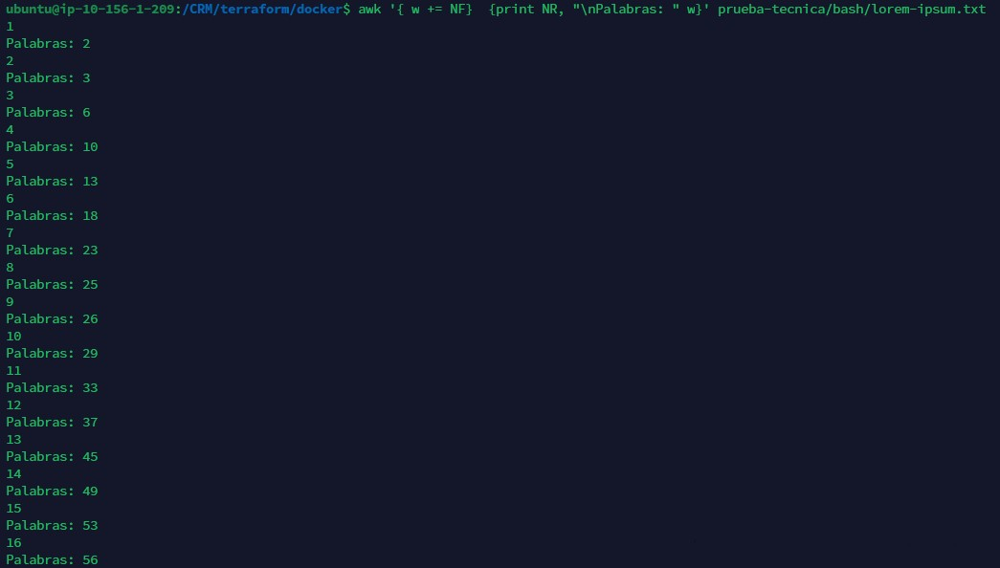
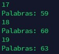
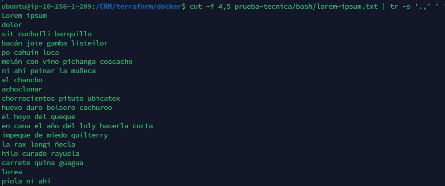
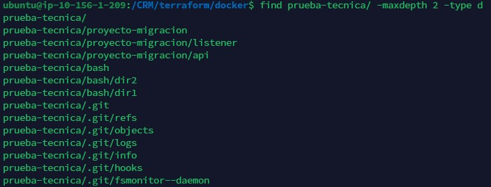
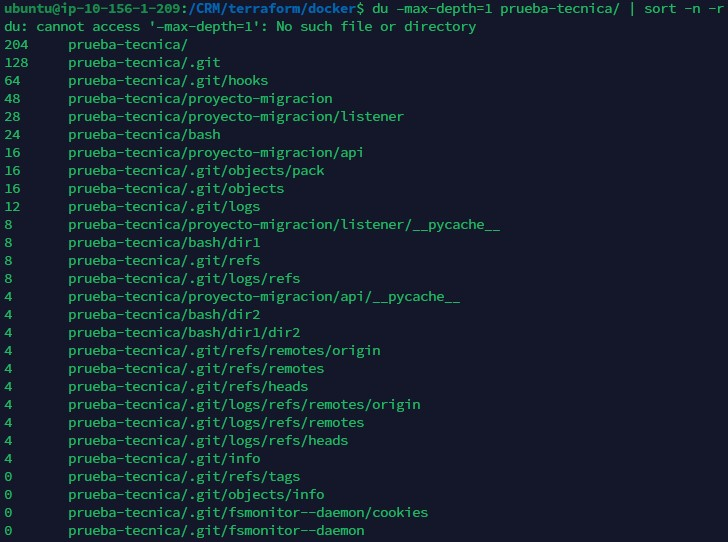

1. Escribe un comando para ver las últimas dos líneas del archivo `lorem-ipsum.txt`, ubicado en el directorio `bash/`:
```respuesta
cat prueba-tecnica/bash/lorem-ipsum.txt | tail -n 2
```



2. Escribe un comando para mostrar la cantidad de palabras que contiene cada línea del archivo `lorem-ipsum.txt`, ubicado en el directorio `bash/`:
```respuesta
awk '{w += NF}{print NR, $0, "\nPalabras: " w}' prueba-tecnica/bash/lorem-ipsum.txt
```





3. Escribe un comando para ver el contenido del archivo `lorem-ipsum.txt`, ubicado en el directorio `bash`, sin los caracteres ***punto*** `.` y ***coma*** `,`:
```respuesta
cut -f 4,5 prueba-tecnica/bash/lorem-ipsum.txt | tr -s '.,' ' '
```



4. Escribe un comando para listar todos los directorios dentro de este repositorio (no recursivo):

```respuesta
find prueba-tecnica/ -maxdepth 2 -type d
```



5. Esribe un comando para ordenar los directorios listados, por tamaño:

```respuesta
du –max-depth=1 prueba-tecnica/ | sort -n -r
```

