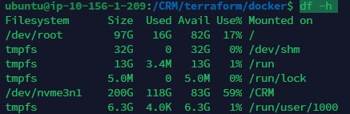
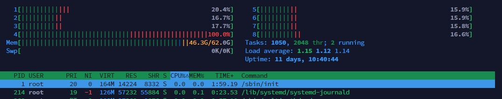
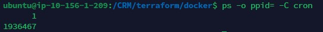
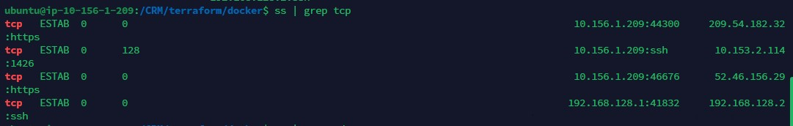
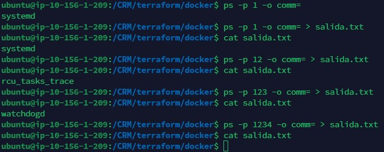

1. Escribe un comando para listar el espacio utilizado por cada partición de disco duro:
```
df -h
```



2. Escribe un comando para mostrar la cantidad de núcleos de CPU con los que cuenta tu sistema:
```
htop
```




3. Escribe un comando para mostrar el PID del proceso `cron`, si éste se está ejecutando, junto al PID de su proceso padre:
```respuesta
ps -o ppid= -C cron
```



4. Escribe un comando para ver los puertos TCP/UDP abiertos por los procesos ejecutándose en background (podría requerir privilegios de root):
```respuesta
ss | grep tcp
```



5. Escribe un comando para ver la salida de `stdout` de un proceso identificado por el PID `1234` (podría requerir privilegios de root):
```respuesta
ps -p 1234 -o comm= > salida.txt
```

