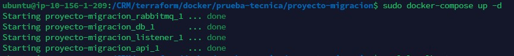

# **2. Habilidades en kubernetes**

En la carpeta **proyecto-migración** hay un pequeño proyecto que nos interesa empaquetar en Kubernetes. La aplicación tiene
como objetivo registrar actividades en una base de datos de manera escalable. Para evitar
saturar la base de datos y aumentar los tiempos de respuesta, la arquitectura esta
compuesta por:
- Un API que recibe peticiones REST, con los mensajes a registrar.
- Una cola de mensajería.
- Un listener que consume los mensajes desde la cola y los inyecta a una base de datos relacional.
Se espera que los servicios queden escalables y en alta disponibilidad .

Para testear la actual solucion que deseamos migrar, puedes levantarla de la siguiete manera:
ingresar a la carpeta **proyecto-migración** y ejecutar

`docker-compose up `

`curl localhost:8000`

